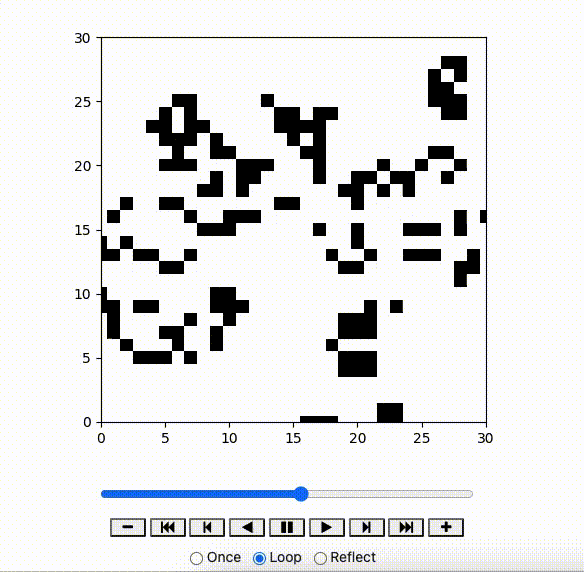

偶然翻到两年前用Python写的Game of Life(康威生命游戏）的脚本，回想当时写这个脚本的背景是，在Kaggle上浏览到了[Conway's Reverse Game of Life 2020](https://www.kaggle.com/competitions/conways-reverse-game-of-life-2020)比赛，比赛规则是用机器学习算法预测在某一阶段的生命游戏图案，其最开始的状态是怎样的；里面有很多大神分享了自己机器学习的过程代码和一些思路，但我更感兴趣的是如何用代码敲出`正向的`生命游戏（显然和比赛的目的完全不相关）。    
在经历了几番尝试实现了最后的效果，代码不复杂，刚好放到博客上。  

### 模块导入
```python
#输出动画
from IPython.display import HTML
from matplotlib.animation import FuncAnimation

import matplotlib.pyplot as plt

#处理数组
import numpy as np
import pandas as pd
from collections import Counter

#内嵌画图，省略掉plt.show()这一步，直接显示图像
%matplotlib inline
```

### 逻辑配置

定义计算周围细胞存活个数的函数。  
我用了o到t这六个字母来标识细胞的坐标：opq是横坐标，rst是纵坐标，这样就可以标识9个细胞。
```python
def get_neighbour_num(array,i,j):   
    o = 0
    p = 0
    q = 0
    r = 0
    s = 0
    t = 0
    alive_cell_num = 0
   
    o = i-1
    p = j-1

    #边界情况
    if i == x_lim -1:
        q = 0
    else: q = i+1
        
    if j == y_lim -1:
        r = 0
    else: r = j+1
        
    s = i
    t = j

    #用Counter计算下存活的与没存活的细胞数，后面的True则是只保留存活的。
    alive_cell_num = Counter([array[o,p],array[o,t],array[o,r],array[s,p],array[s,r],array[q,p],array[q,t],array[q,r]])[True]
    return alive_cell_num
```

定义产生次代细胞的函数。
```python
##得到新数组
def next_generation_array(array):
    neighbour_list = []

    #遍历每个单元格周围的活着的细胞数
    for i in range(x_lim):
        for j in range(y_lim):
            live_cell_num = get_neighbour_num(array,i,j)
            neighbour_list.append(live_cell_num)

    #判断是否生死
    array_line = np.reshape(array,(1,x_lim*y_lim))
    live_list = []
    for i,j in enumerate(neighbour_list):
        
        #中央细胞活着，周围有两个活着三个活细胞，保持存活
        if array_line[0,i] and (j == 2 or j == 3):
            live_list.append(True)
        #中央细胞死亡，周围有三个活细胞，转为存活
        elif (not array_line[0,i]) and j ==3:
            live_list.append(True)
        #其他情况，转为死亡
        else:    
            live_list.append(False)
            
    return np.reshape(live_list,(x_lim,y_lim))

```

### 作图
定义初始数组与迭代次数。
```python
X = np.zeros((30, 40), dtype=bool)
r = np.random.random((29, 39))
X[1:30, 1:40] = (r > 0.75)

x_lim = X.shape[0]
y_lim = X.shape[1]

#定义迭代次数
generation_times = 100
```
定义迭代数组。

```python
frame = [X]
generation_array = X
#把每次循环后的数组拼接到frame中
for i in range(generation_times):
    generation_array = next_generation_array(generation_array)
    frame.append(generation_array)   
```
定义画布。
```python
fig, ax = plt.subplots(figsize = (5,5))

ln, = plt.plot([], [], 'ro')
```
作图。
```python
def init():
    ax.set_xlim(0, 30)
    ax.set_ylim(0, 30)
    return ln

def update(frame):
    ax.imshow(frame,cmap = 'binary')
    return ax.plot()

ani = FuncAnimation(fig, update, frames=frame,
                    init_func=init, blit=False)


HTML(ani.to_jshtml())
```

关于[FuncAnimation](https://matplotlib.org/stable/api/_as_gen/matplotlib.animation.FuncAnimation.html) 的说明.



### 最终效果


### 主题升华下
游戏虽然简单，但是十分形象的展示了生命诞生、演进与消亡的过程。不同的初始生命会在一套规则下，产生一代代不一样的生命，未来几百年的一颗小树，是不是在今天就已经注定了诞生？

