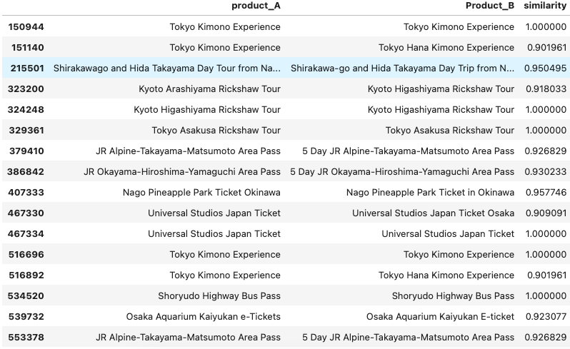

在这一篇博客中，会介绍一个比较两个字符串相似程度的Python工具包，通过它我们可以比较容易的了解字符串之间“长得”有多像。
### 使用场景
在工作中，我会用这个工具来帮我比较自己公司和竞争对手在产品覆盖面上的差异（前提是我们已经拿到了他们的产品清单数据），即有多少产品我们都有售卖、有多少产品他们有但是我们没有等。

### 代码介绍
这个工具的名字是`difflib`，属于python的内置库，通过`SequenceMatcher`的方法可以比较文本串之间的距离，即相似度。 

[difflib.SequenceMatcher](https://docs.python.org/zh-cn/3.11/library/difflib.html) 文档.


首先进行环境配置及函数创建。
```python
import csv
import pandas as pd
from difflib import SequenceMatcher

def similar(a, b):
    return SequenceMatcher(None, a, b).ratio()
```
读取数据，里面包括两列待比较的文本数据。
```python
#-*- coding=utf-8 -*-
data=pd.read_csv("product_list.csv",encoding="utf-8")
```

将两列数据拆成两个DataFrame.
```python
Product_list_A=data['A platform']
Product_list_B=data['B platform']
```

通过for循环进行遍历比较，`similarity`这一列便是两列文本的相似度值，将结果存入一个csv文档。
```python
with open("similarity.csv","w") as file:
    writer=csv.writer(file)
    writer.writerow(['product_A','Product_B','similarity'])
    
    for i in Product_list_A:
        for j in Product_list_B:
              writer.writerow([i,j,similar(i,j)])  
```

查看下比较后的结果，通常相似度大于0.9的即A和B平台同时都有的产品。
```python
similarity=pd.read_csv('similarity.csv')
similarity[similarity.similarity>0.9]
```


### 一个缺点
上面采用的方式是串行的遍历比较，效率方面并不高。    
上面的数据集A有592条数据，B有1048条数据，产生的结果有592*1048=620416条，计算的时间大约有两分钟，供您参考。


