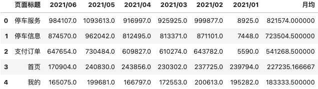
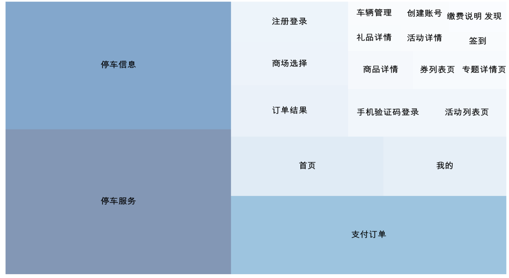

### 前言
当我们想展示数据之间的大小差异时，饼图会是一个不错的选择，但有时为了将数据展示的更“高级”，可以考虑用树状图。  
树状图通过展示不同大小的矩形，以传达不同大小的数据量，较大的矩形意味着占总体的一大部分，而较小的矩形意味着整体的一小部分。  
在本文将展示如何利用pyhon绘制APP中用户主要浏览界面的树状图。  


### 环境配置
使用`Pandas`来导入数据，`squarify`来完成后面的画图。
```python
import pandas as pd             # Read data from excel
import matplotlib               # data viz
import matplotlib.pyplot as plt # data viz
import squarify  
import numpy

%matplotlib inline
```
后面发现在excel导入的数据会出现乱码，添加如下部分。
```python
# 解决中文乱码
plt.rcParams["font.sans-serif"]=["Arial Unicode MS"]

# 解决负号无法显示的问题
plt.rcParams['axes.unicode_minus'] =True
```
### 数据处理
导入excel文件中“数据处理”页面中的数据：
```python
df = pd.read_excel(r'用户主要浏览页面.xlsx', sheet_name = '数据处理')
```

取前面几行看一下（其实只需要“页面标题”、“月均”（指月均浏览量）这两列就可以）。
```python
df.head()
```


因为数据行数太多，太小的数据画出来后会看不清，影响树状图美观成都，所以只取月均浏览量大于两万的数据作图。
```python
df_new = df[df['月均'] >= 20000
```

创建颜色画布，我选择了一个蓝色的基色。
```python
cmap=matplotlib.cm.Blues
#Normlize是用来把数据标准化(归一化)到[0,1]这个期间内,vmin是设置最小值, vmax是设置最大值，小于最小值就取最小值，大于最大值就取最大值。
norm=matplotlib.colors.Normalize(vmin=df_new['月均'].min(), 
                                 vmax=df_new['月均'].max())
#每个数字赋予一个颜色                                 
colors=[cmap(norm(i)) for i in df_new['月均']]
```

### 作图
```python
plt.figure(figsize=(50,30))
title="用户页面浏览情况"
##plt.title(title, size=18)

squarify.plot(df_new['月均'], label=df_new['页面标题']
              ,text_kwargs={'color':'black', 'size':50}    #设置文字颜色与大小
              ,color=colors
              ,alpha=.5
             )

plt.axis('off')
plt.show()
```


通过这个图可以看到最多用户浏览的界面分布，以及它们之间浏览量的差距，为后期优化界面的布局提供参考。


