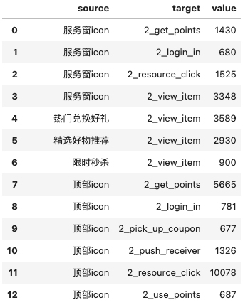

### 背景
两年前我还在一家商业地产公司工作，工作内容是关注用户在APP上的行为，然后分析如何提升活跃与转化，促进下营收的增长。   
当时在和一家做线上运营分析平台的公司合作，可以直接用他们的系统已经集成了比较多的分析功能，埋点数据也都保存在他们数据库中；但是在进行比较个性化的分析时这个系统的功能就有点捉襟见肘了，所以打算自己导出这些数据，通过Python来画出这些客户是怎么跳转的，然后分析出怎么让他们尽可能多的留在APP中。   
本文就是照着之前的代码还原下用Python绘制用户跳转路径的过程，最终以桑基图的形式呈现出来，就当是给自己的一堂代码复习课。

### 环境配置

使用`Pandas`来清洗数据，`Sankey`来完成后面的画图。
```python
import os
import glob
import pandas as pd

import numpy as np 
import seaborn as sns
import matplotlib.pyplot as plt
from datetime import datetime

import matplotlib.animation as animation
from pyecharts.charts import Sankey
from pyecharts import options as opts
from pyecharts.render import make_snapshot
```


### 数据清洗
当时是从分析系统服务器导出了埋点数据到本地，每个都是csv文件，所以先把本地的csv文件汇总一下。
```
extension = 'csv'
all_filenames = [i for i in glob.glob('*.{}'.format(extension))]

```
当时也发现了一部分异常数据，比如有的用户在注册之前已经开始在我们APP上有活跃行为了，先把这些人找出来后面剔除掉。

```python
#xwhen是行为日期，regiset_date是注册日期
ar1 = np.array([])
for i in all_filenames:
    df_i = pd.read_csv(i)
    if df_i.shape[0] >0: 
        act_b4_reg =  df_i[df_i.xwhen < df_i.register_date].distinct_id
        ar1 = np.concatenate((ar1,act_b4_reg))
```
取每个文件的首次使用功能，后面排序时会用到rank。
```python
for i in all_filenames:
    df_child = pd.read_csv('{0}'.format(i))
    if df_child.shape[0] >0:
     
        df_child['rank'] = df_child.groupby('distinct_id')['xwhen'].rank(ascending = True)
        df_child = df_child[df_child['rank'] == 1.0]
        
        df_child.to_csv('./min_xwhen_filter/child_{0}'.format(i))
```
读取新的文件，把每个child汇总成一个parent，查了下有四百万条记录。
```python
os.chdir("./min_xwhen_filter")

extension = 'csv'
all_filenames_new = [i for i in glob.glob('*.{}'.format(extension))]

df_parent = pd.concat([pd.read_csv(f) for f in all_filenames_new ])
df_parent.drop(['Unnamed: 0','Unnamed: 0.1'], axis = 1,inplace = True)
```
特征处理，把日期加工成可读的格式。
```python
#每天的数据汇总会再排一下序
df_parent['rank'] = df_parent.groupby('distinct_id')['xwhen'].rank(ascending = True)
df_parent['xwhen2'] = pd.to_datetime(df_parent['xwhen']/1000,unit = "s") + pd.Timedelta('08:00:00')
df_parent['register_date2'] = pd.to_datetime(df_parent['register_date']/1000,unit = "s") + pd.Timedelta('08:00:00')
#计算转化天数
df_parent['convert_days'] = (df_parent.xwhen2 - df_parent.register_date2).dt.days

df_parent['month'] = df_parent.xwhen2.dt.strftime('%Y-%m-%d').apply(lambda x: x[0:7] )

df_parent['quarter'] = df_parent.xwhen2.dt.strftime('%Y-%m-%d').apply(lambda x:  x[0:4]+
                                                            ( 'Q1' if int(x[5:7]) <4
                                                                else ('Q2' if int(x[5:7]) < 7
                                                                            else ('Q3' if int(x[5:7]) <10
                                                                                        else 'Q4'
                                                                                    )
                                                                       )
                                                               )
                                                 )

```
剔除注册之前活跃的用户
```python
df_parent = df_parent[~df_parent.distinct_id.isin(ar1)]
```

```python
#将resource_click 与其他xwhat分开
df_rsc_clck = df_parent2[df_parent2.xwhat == 'resource_click'][['distinct_id','rank','resource_location']].drop_duplicates()

#为了找到跳变的rank(即两次resource_click之间还存在其他xwhat，加入rank2)
df_rsc_clck['rank2']  = df_rsc_clck.groupby('distinct_id')['rank'].rank(ascending = True)

#rank!=rank2的位置即为跳动的位置
df_user_jump_location = pd.DataFrame(df_rsc_clck[df_rsc_clck['rank'] != df_rsc_clck.rank2].groupby('distinct_id')['rank'].min()).reset_index()

#筛选跳动之前的resource_click
df_rsc_clck = df_rsc_clck.merge(df_user_jump_location, how = 'left',on = 'distinct_id')
df_rsc_clck = df_rsc_clck[df_rsc_clck.rank_x < df_rsc_clck.rank_y][['distinct_id','rank_x','resource_location']]
df_rsc_clck.rename(columns = {'rank_x': 'rank'}, inplace = True)

#再重新构造rank2是为了保留跳变前最后一条resource_click
df_rsc_clck['rank2'] = df_rsc_clck.groupby('distinct_id')['rank'].rank(ascending = False) ##注意ascending = False
df_rsc_clck = df_rsc_clck[df_rsc_clck.rank2 == 1][['distinct_id','rank','resource_location']]
```

```
#筛选resource_click之后的xhwat
df_after_rec_click = df_parent2.merge(df_rsc_clck, how = 'left', on = 'distinct_id')
df_after_rec_click = df_after_rec_click[df_after_rec_click.rank_x > df_after_rec_click.rank_y][['distinct_id','rank_x','xwhat']]
df_after_rec_click.rename(columns = {'rank_x': 'rank'}, inplace = True)

#通过位移的方式找到前后两条相同的xwhat并去重
df_after_rec_click = df_after_rec_click.sort_values(by = ['distinct_id','rank'], ascending = True)
df_after_rec_click = df_after_rec_click.merge(df_after_rec_click.shift(-1), left_index  = True, right_index=True).\
                     fillna(0) #merge by index
df_after_rec_click = df_after_rec_click[(df_after_rec_click.distinct_id_x == df_after_rec_click.distinct_id_y) & \
                                        (df_after_rec_click.xwhat_x != df_after_rec_click.xwhat_y)]
df_after_rec_click = df_after_rec_click[['distinct_id_x','rank_x','xwhat_x']].\
                     rename(columns = {'distinct_id_x':'distinct_id','rank_x': 'rank', 'xwhat_x':'xwhat'})
```

```python
#合并resource_click与其之后的xhwat
df_user_journey = pd.concat([df_rsc_clck.rename(columns = {'resource_location': 'xwhat'}), df_after_rec_click])
del df_rsc_clck
del df_after_rec_click
```

```python
#通过rank2来排序
df_user_journey['rank2'] = df_user_journey.groupby('distinct_id')['rank'].rank(ascending = True)
df_user_journey.to_csv('./user_journey/user_journey.csv')
```

```python
df_user_journey = pd.read_csv('user_journey.csv')
df_user_journey.drop('Unnamed: 0', axis = 1, inplace = True)
```
### 要素构建

桑基图组成要素——节点、边和流量。
```python
test_user_journey = df_user_journey[df_user_journey.rank2 == 1].\
                     merge( df_user_journey[df_user_journey.rank2 == 2], how = 'left', on = 'distinct_id').\
                     merge( df_user_journey[df_user_journey.rank2 == 3], how = 'left', on = 'distinct_id')

test_user_journey = test_user_journey[['distinct_id','xwhat_x','xwhat_y','xwhat']].rename(columns = {'xwhat' : 'xwhat_z'})
test_user_journey = pd.DataFrame(test_user_journey.groupby(['xwhat_x','xwhat_y','xwhat_z']).distinct_id.nunique()).reset_index()

test_user_journey = test_user_journey.sort_values(by = 'distinct_id',ascending = False).head(30)
test_user_journey = test_user_journey.sort_values(by = ['xwhat_x','xwhat_y','xwhat_z'],ascending = False)
```

```
test_user_journey['xwhat_y'] = '2_'+a.xwhat_y
test_user_journey['xwhat_z'] = '3_'+test_user_journey.xwhat_z
```
定义桑基图的节点：
```python
nodes = []

for i in range(3):
    values = test_user_journey.iloc[:,i].unique()
    for value in values:
        dic = {}
        dic['name'] = value
        nodes.append(dic)
```

```python
first = test_user_journey.groupby(['xwhat_x','xwhat_y'])['distinct_id'].sum().reset_index()
second = test_user_journey.groupby(['xwhat_y','xwhat_z'])['distinct_id'].sum().reset_index()
first.columns = ['source','target','value']
second.columns = ['source','target','value']
result = pd.concat([first,second])
```
搭建好后基本是这种形态(取了DataFrame的前几条数据)：


用循环便利的方式将流量转换成桑基图可使用的字典格式：
```python
linkes = []

for i in result.values:
    dic = {}
    dic['source'] = i[0]
    dic['target'] = i[1]
    dic['value'] = i[2]
    linkes.append(dic)
```

### 绘图

```python
pic = (
    Sankey()
    .add('',
         nodes,
         linkes,
         linestyle_opt=opts.LineStyleOpts(opacity = 0.3, curve = 0.5, color = 'source'),
         label_opts=opts.LabelOpts(position = 'top'),
         node_gap = 15,
    )
    .set_global_opts(title_opts=opts.TitleOpts(title = '客户购买路径流转图'))
)
```

再把呈现的图保存成html格式就好啦：
```python
pic.render('客户购买路径流转图.html')
```


