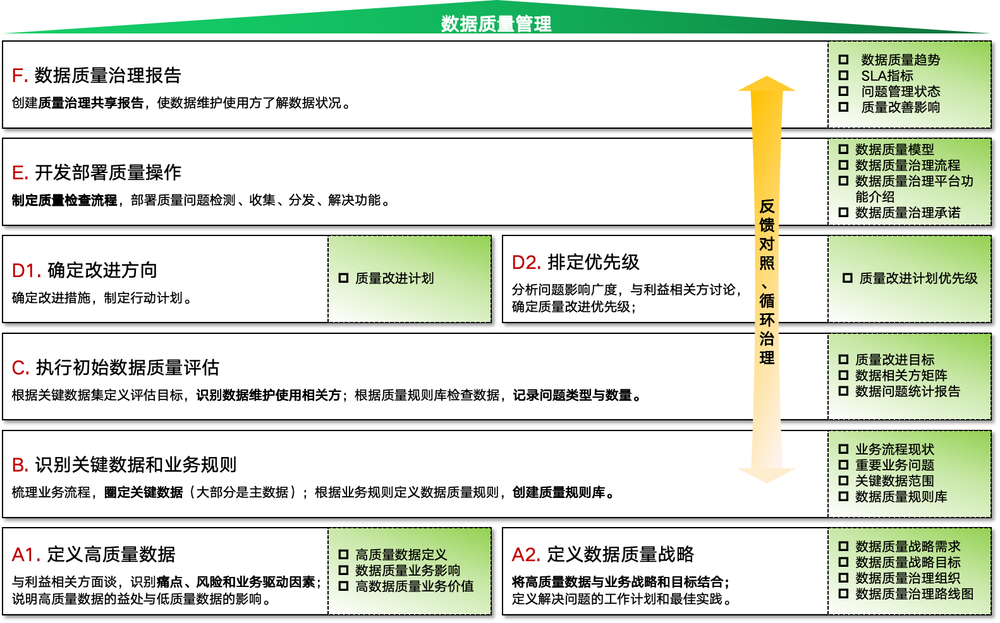
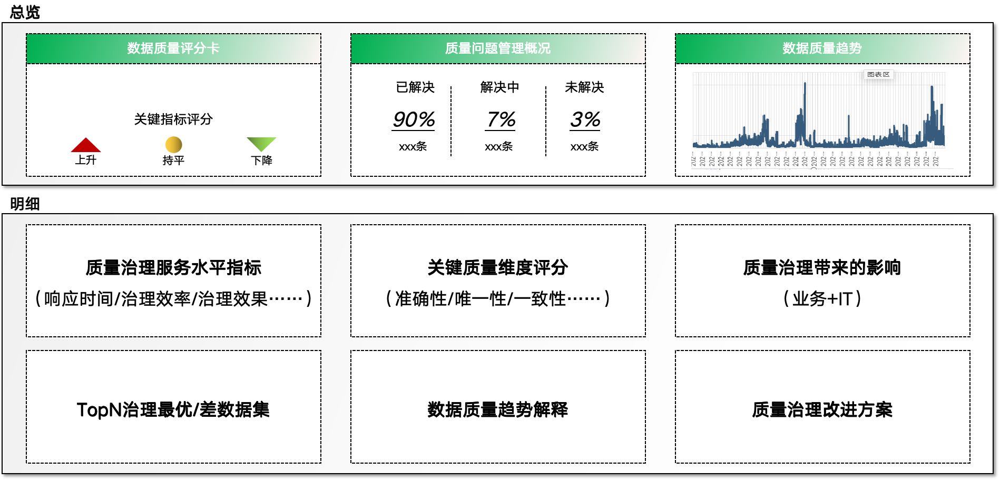

### 为什么要做数据质量管理
无论您是不是从事与数据相关的岗位，工作中都离不开各种数据。数据并不只存在于计算机中，您的通讯录、超市里商品的价格表、或者随意记下来的一串数字，都是数据。   
如果这些数据出了差错，不光买菜时都会付错价钱，也会在您工作中带来失误、造成不可估量的损失，所以高质量的数据是做任何事情都必不可少的，对数据质量的管控也是每个人都会参与的。  

### 数据质量管理框架
那么应如何来做质量管理，国籍数据管理协会（DAMA）在DMBOK2中做出了说明，结合里面内容我做了部分调整，搭建出了如下的框架。  

这个框架分为六层，从中可以解读出数据质量管理的what与how。     
what：下面三层（A、B、C），指导我们做数据质量管理的标的是哪些。  
how：上面三层（D、E、F），选定标的后，具体应该做哪些内容。     

下面将说明下自己对每层的理解：    

#### A-定义高质量数据与定义数据质量治理战略
这一层是为了明确我们做数据质量管理的目的，解决利益相关方当前面对数据的问题，或者满足业务战略发展的需要。  
最终我们要得到这些产出：  
- 数据质量的业务影响及高质量数据的价值（可减轻项目推进过程中的阻碍因子）
- 数据质量的战略目标与组织图（确保相关方知悉并达成共识）
- 数据质量治理路线图（到具体时间、具体对象的项目计划）
#### B-识别关键数据和业务规则
利益相关方关注的质量问题可能会有很多，我们要筛选出对业务影响最大、最核心的数据优先采取质量管理，并挖掘这批数据涉及的流程、系统。  
另外关键的一点是建立质量规则库，在这个库中定义了数据质量管理的维度：准确性、唯一性、有效性、完整性、时效性、一致性。  
#### C-执行初始数据质量评估
基于建立好的质量规则库，来探查圈定的数据对象的质量如何。通过这一步我们可以知道数据出现了哪些问题、这些问题的出现频率。可以根据这些内容制定数据质量改进目标。
#### D-确定改进方向与排定优先级
根据质量问题的不同，达成质量改进目标有多种方式，比如可以推进流程改善、修复系统漏洞、制定相关方责任等，选择这些方式要综合考量项目的周期和成本，之后制定数据质量改进进化优先级。   
#### E-开发部署质量操作
在这一层，结合数据质量治理路线图，把数据质量改进计划落实。大多数数据质量治理需要流程的完善，所以对改进后流程的说明是必不可少的。
#### F-数据质量治理报告
治理报告是数据质量管理的仪表盘，一方面要展示数据质量的整体水平（下滑、上升、整体趋势），一方面要呈现具体数据对象的质量水平。  

下方是一个简单的示意，明细是对总览的细化说明，具体开发时要结合实际的业务需求，将他们关注的质量问题指标呈现出来。

在数据质量治理报告产出后，便察觉我们做的质量管理内容的遗漏点，或者哪些数据的质量还是比较低。有了这些洞察之后可再次回到B层（识别关键数据和业务规则），按照框架的指引方向继续实施数据质量管理，这也是PDCA思想的应用。

