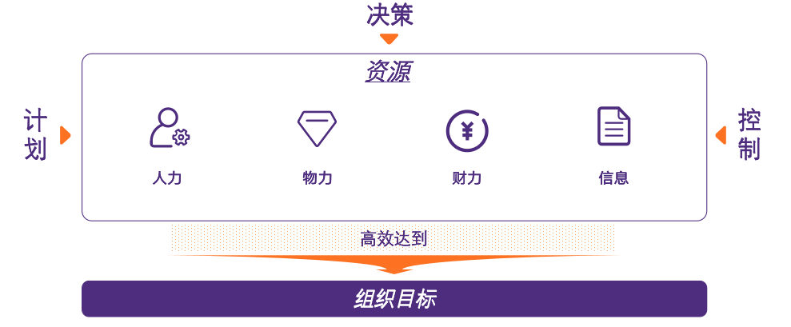
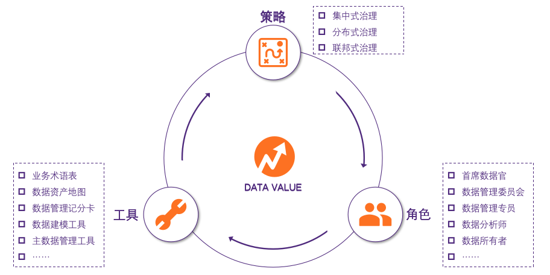
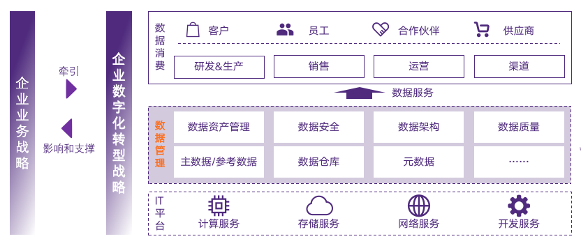
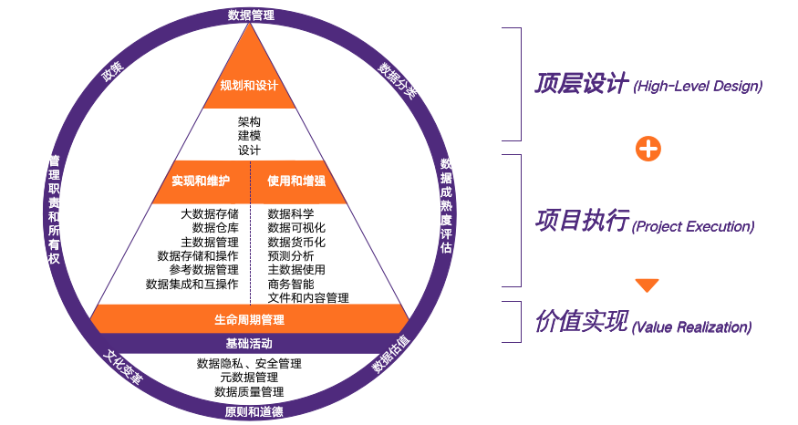
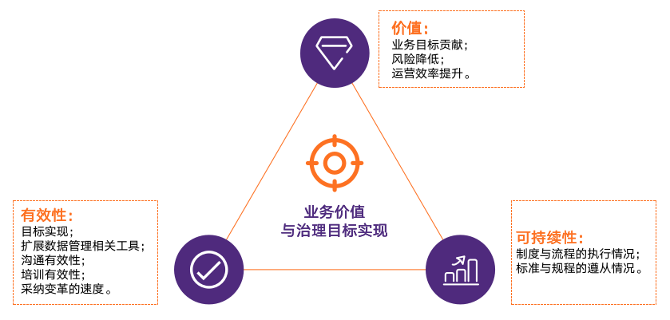

最近一两年的工作经历大部分和数据管理相关，很多时候要把这些的内容介绍给客户，所以在这个领域有一点点自己的理解。  
很多内容都是参考了DAMA的《数据管理知识体系指南第二版》(DMBOK2)，这本书对数据管理领域每个部分都有解读，虽然内容繁厚，但仔细读了几遍之后对我帮助很大。




为了介绍数据管理我们先看什么是管理：  
首先管理是一种行为，行为的核心是对人力、物力、财力、信息等资源进行有效的决策、计划、控制，
以实现高效的达到组织目标的目的。

  




数据管理的对象是“数据”，但是因为数据是无形的，所以它是指有效管理和利用数据相关的策略、工具和角色，从而确保数据在组织内提供尽可能多的价值的行为。
我很喜欢DMBOK2的这句话：“数据治理从根本上讲是关于组织行为的”。

  




数字化转型是企业的必答题：IDC（国际数据公司）预测，鉴于竞争对手和产业都在进行数字化转型，如果企业不能快速实现数字化转型，到2025年，它们逾三分之二的目标市场会消失。数据管理是数字化转型的关键，是提供成熟数据服务的基础，数字化转型中70%的工作都与数据管理相关。

  




在DMBOK2中的数据管理框架中，各应用活动支撑着数据全生命周期管理。我把这个框架划分为以下三部分：
<ul>
  <li>顶层设计：模型是数据的载体，需要通过数据建模来实现；数据建模包括正向建模与逆向建模，它更多解决了数据管理怎么做（HOW）的内容，但是为什么做（WHY）就需要通过数据架构设计了。</li>
  <li>项目执行：执行了从实现和维护（集中于后端管理、主要由IT参与）、到使用和增强（集中于前段应用、主要由业务端与数据端参与）的管理路径。</li>
  <li>价值实现：通过如上两部分，结合数据管理的国家政策、行业标准才能真正实现数据的全生命周期管理。</li>
</ul>


  




借鉴上述数据管理框架，常规治理推进可遵循如下路线：
<ul>
  <li>数据管理组织搭建：要推进数据管理进程的顺利进行，需要任命一个组织/个人作为项目的owner，推动解决进程中的各种问题。</li>
  <li>数据架构设计与建模：如在数据管理管家中的陈述，这部分是“顶层设计”；做项目前，先把项目的框架搭建出来。</li>
  <li>数据拉通与维护：依照设计的架构蓝图，将关键数据（主数据、元数据等）存储到数据仓库/湖中，沉淀数据资产。</li>
  <li>数据使用与增强：通过商务智能/大数据技术，支撑数据资产的价值实现。</li>
</ul>

  




衡量数据管理项目是否达到预期目标，可通过如下指标来衡量：
<ul>
  <li>价值：指的是数据管理的是否对我们的业务有价值？有没有降低了风险，有没有帮助实现运营目标？</li>
  <li>有效性：这里更强调的是同事之间的协作有没有在数据管理项目之后变得更顺畅，如果仅仅是产出了一些大家平时用不到的文档，项目的价值就要大打折扣。</li>
  <li>可持续性：数据管理的是一个漫长的过程，需要在一个比较宽的纬度来审视效果，所以可持续性也是衡量数据管理价值的一个重要维度。</li>
</ul>

  





